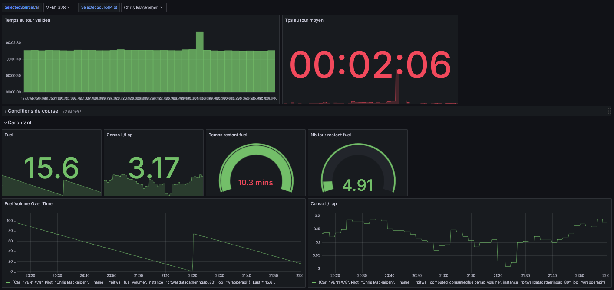
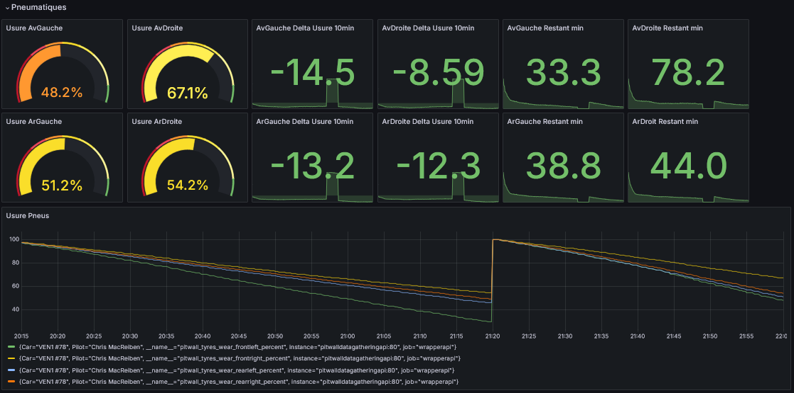
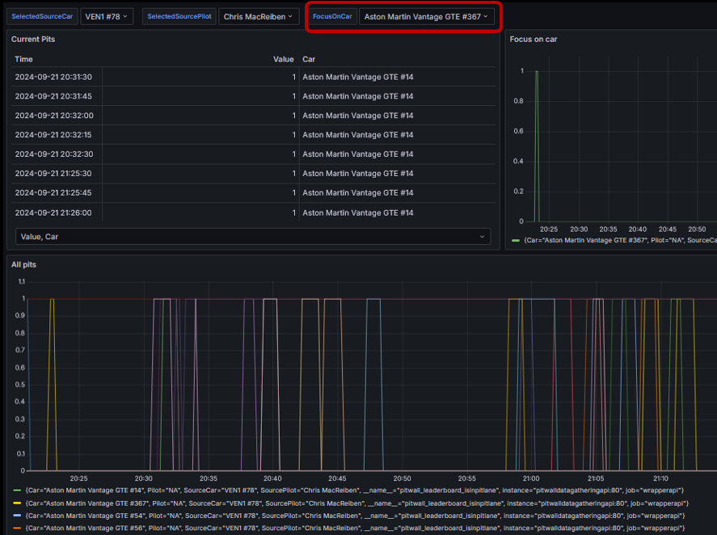

# Pitwall Acquisition Plugin

This is a plugin that works with Simhub. It forward data to a web platform for you to plan strategy and analyze the car behaviour.

Since it's a SimHub plugin, you can use it with various simulator.

## Versions
- [Download latest Stable version](https://github.com/macreiben-dev/pit-wall-acquisition/releases/tag/Live-20240917.2-852)
- [Download Release Candidate version](https://github.com/macreiben-dev/pit-wall-acquisition/releases/tag/RC-20240605.1-820)

## Pre requisites

- Simhub 9.x installed

To be able to work with the data, please see [pit-wall-api](https://github.com/macreiben-dev/pit-wall-api) documentation.

- Gary Swallow plugin installed in SimHub

To be able to have the pitting information you need download [Simhub Gary Swallow plugin](https://www.overtake.gg/downloads/simhub-tv-style-side-scrolling-leaderboards-timings-sidescreen.18746/)

## What does it do ?

Here is a glimpse of what the pitwall can do.

### Fuel live analysis/consistency

### Tyre wear live analysis

The gauges present the current tyre wear. Next to it are the wear delta over the last 10 min.

On the right, are the remaining time on each tyre based on the last 10 minutes of data.

### Live piting information

This dashboard allows you to see who is in pitlane and for how long. So you can see who's pitting, doing penalties etc ... .

## How does it work ?

Any simulator supported by [SimHub](https://www.simhubdash.com/) can be used with the plugin.

## Setup the plugin

- Download the latest release
- Unzip the binaries downloaded archive
- Copy the files in Simhub installation directory
  - If you are updating from an existing version,
    - Ensure Simhub is not running
    - Say yes to replace existing file with the new files
- Start Simhub

### First installation

- Go to Settings

- Then plugins

- Ensure plugins is activated

You can check the checbox "Show in the left main menu" to access the plugin directly.

### Configuration

- Open the plugin configuration screen
- Set the pilot name and car name

This two informations will be use to group the metrics by car and pilots.

It is recommended to have a unique pilot name by user. Car name can be shared. Doing so will enable you to support driver swap scenarii.

- Set the server address and personal key

Personal key will be checked each time a user tries to send metrics. One server knows one personal key.

- Click save button

Save button updates the configuration. You do not need to restart Simhub.

- Test Connectivity button

Tries to contact the server without authentication. This is to avoid personal key brut force attack.

- OK : server is reachable
- KO : server is unreachable

To setup the server see [pitwall api](https://github.com/macreiben-dev/pit-wall-api)
