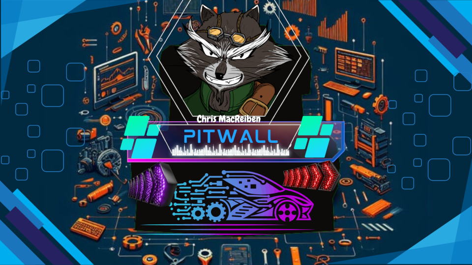
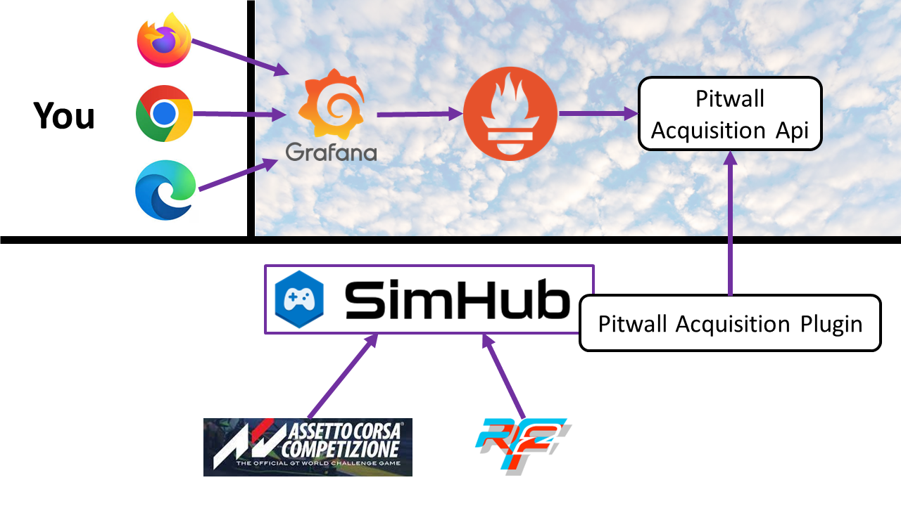
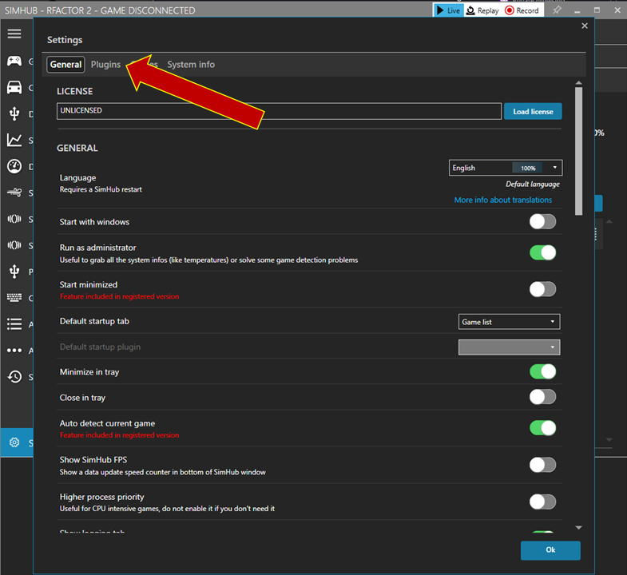
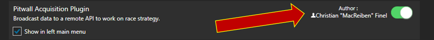
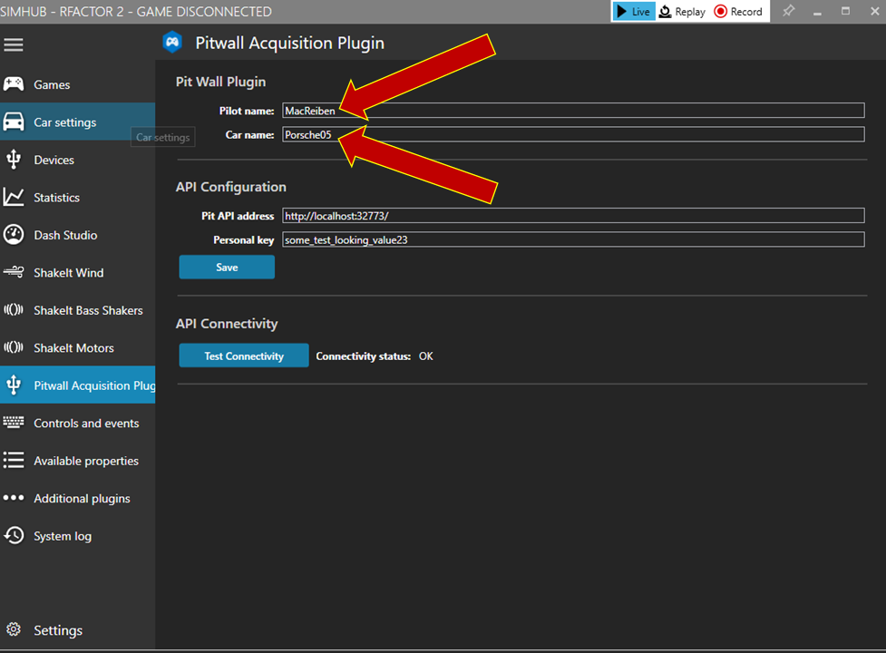
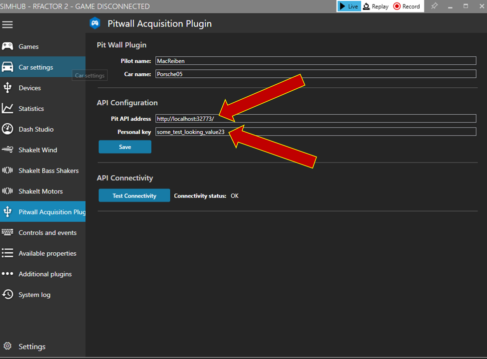
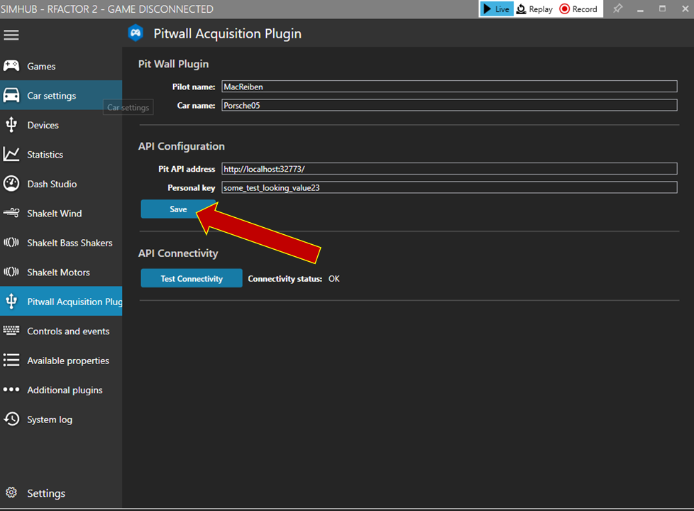

# Pitwall Acquisition Plugin

This plugin is to be used with simhub to forward data to a WebApi. This WebApi then exposes an endpoint to feed a prometheus database.

## Versions
- [Download latest Stable version](https://github.com/macreiben-dev/pit-wall-acquisition/releases/tag/Live-20231126.5)
- [Download Release Candidate version](https://github.com/macreiben-dev/pit-wall-acquisition/releases/download/RC-20240520.2-801/PitwallAcquisitionPlugin-RC-20240520.2-801.zip)

## Pre requisites

- Simhub 9.x installed

To be able to work with the data, please see [pit-wall-api](https://github.com/macreiben-dev/pit-wall-api) documentation.

## How does it work ?

Any simulator supported by [SimHub](https://www.simhubdash.com/) can be used with the plugin.

## Setup the plugin

- Download the latest release
- Unzip the binaries downloaded archive
- Copy the files in Simhub installation directory
  - If you are updating from an existing version,
    - Ensure Simhub is not running
    - Say yes to replace existing file with the new files
- Start Simhub

### First installation

- Go to Settings

- Then plugins

- Ensure plugins is activated

You can check the checbox "Show in the left main menu" to access the plugin directly.

### Configuration

- Open the plugin configuration screen
- Set the pilot name and car name

This two informations will be use to group the metrics by car and pilots.

It is recommended to have a unique pilot name by user. Car name can be shared. Doing so will enable you to support driver swap scenarii.

- Set the server address and personal key

Personal key will be checked each time a user tries to send metrics. One server knows one personal key.

- Click save button

Save button updates the configuration. You do not need to restart Simhub.

- Test Connectivity button

Tries to contact the server without authentication. This is to avoid personal key brut force attack.

- OK : server is reachable
- KO : server is unreachable

To setup the server see [pitwall api](https://github.com/macreiben-dev/pit-wall-api)
